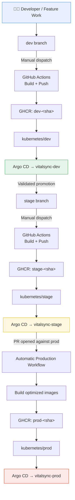
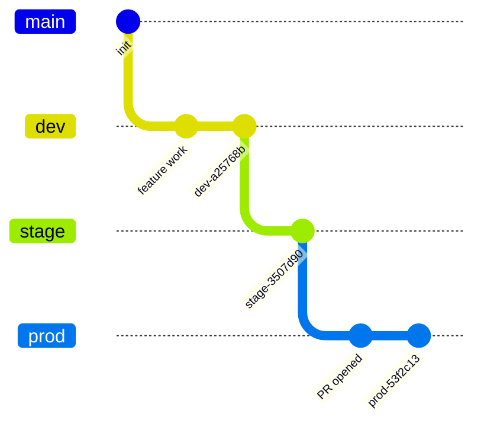
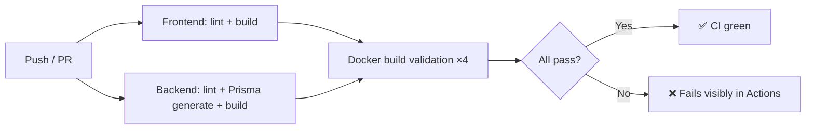

<div align="center">

# 🩺 VitalSync — DevOps Capstone

**Production-style CI/CD, containerization, Kubernetes, and GitOps delivery for a real full-stack health tracking platform.**

[](.github/workflows/ci.yml)
[](#kubernetes-delivery)
[](#argo-cd-gitops)
[](#image-versioning)
[](#aws-and-runtime-environment)
[](#current-status)

</div>

---

## Overview

This repository demonstrates a complete, auditable promotion path across **Development → Staging → Production** for the **VitalSync** health-tracking platform. It replaces a toy reference app with a real frontend, backend, database, authentication layer, and dashboard — giving stronger evidence that the delivery pipeline works beyond a minimal demo.

| Layer | Technology |
|---|---|
| Frontend | Next.js |
| Backend | Node.js, Express, TypeScript, Prisma |
| Database | PostgreSQL |
| Container Registry | GitHub Container Registry (GHCR) |
| Orchestration | Kubernetes (K3s) |
| GitOps | Argo CD |
| Cloud | AWS EC2 |
| Repository | [github.com/EbnulAhsan/vitalsync-devops-capstone](https://github.com/EbnulAhsan/vitalsync-devops-capstone) |

### Assignment coverage at a glance

- ✅ Long-lived `dev`, `stage`, `prod` branches
- ✅ Continuous integration on every push and pull request
- ✅ Manually triggered Development deployment
- ✅ Manually triggered Staging deployment
- ✅ Automatically triggered Production deployment on PR open against `prod`
- ✅ Separate Development / Production Docker build strategies
- ✅ Commit-identifiable image tags
- ✅ Kubernetes Deployments + Services, **no Ingress**
- ✅ Namespace-level environment isolation
- ✅ Argo CD reconciliation for all three environments
- ✅ End-to-end verification: registration, login, health check, dashboard access

---

## Architecture



Each environment runs an isolated PostgreSQL instance, backend, and frontend. Kubernetes Services provide internal database connectivity and NodePort access to the application — **no Ingress resource is used**, as required by the assignment.

---

## Branching & Promotion Strategy



| Branch | Purpose |
|---|---|
| `dev` | Integration branch for active development and Development validation |
| `stage` | Validated release candidate for Staging and Production promotion |
| `prod` | Production release history and pull-request promotion target |
| `main` | Retained as an additional branch; the assessed path is `dev → stage → prod` |

**Promotion path:** `feature work → dev → stage → pull request against prod`

Development and Staging never deploy just because code lands on the branch — a human must explicitly run the workflow. Production follows the assignment's non-negotiable rule: it deploys automatically the moment a pull request is **opened** against `prod`.

---

## Continuous Integration

**Workflow:** [`.github/workflows/ci.yml`](.github/workflows/ci.yml) — runs on every push and pull request touching `dev`, `stage`, or `prod`.



| Stage | Checks |
|---|---|
| Frontend | `npm ci`, lint, Next.js build |
| Backend | `npm ci`, Prisma Client generation, lint, TypeScript build |
| Docker | Validates Frontend Dev, Frontend Prod, Backend Dev, Backend Prod images build cleanly (not pushed) |

CI never publishes images — that responsibility belongs solely to the environment delivery workflows.

---

## Continuous Delivery

### 🔧 Development — manual

`workflow_dispatch` → checks out `dev` → builds with `Dockerfile.dev` → pushes `dev-<sha>` → updates `kubernetes/dev` → bot commit → Argo CD reconciles.

| Verified version | GitOps commit |
|---|---|
| `dev-a25768b` | `28297f6` |

### 🧪 Staging — manual

`workflow_dispatch` → checks out `stage` → builds optimized images with `Dockerfile.prod` (frontend points at Staging backend) → pushes `stage-<sha>` → updates `kubernetes/stage` → bot commit → Argo CD reconciles.

| Verified version | GitOps commit |
|---|---|
| `stage-3507d90` | `b42707d` |

### 🚀 Production — automatic on PR open

```yaml
on:
  pull_request:
    branches: [prod]
    types: [opened]
```

Opening a PR against `prod` automatically builds optimized images from `stage`, pushes `prod-<sha>`, updates `kubernetes/prod`, commits the GitOps change, and lets Argo CD reconcile — **no manual step required afterward**.

| Verified PRs | Latest version | Latest GitOps commit |
|---|---|---|
| `#4`, `#5` (both successful) | `prod-53f2c13` | `e5fec93` |

---

## Production GitOps Branch Decision

The Production Argo CD Application intentionally tracks:

```yaml
targetRevision: stage
path: kubernetes/prod
```

The assignment requires Production to deploy when a PR is **opened**, not merged. `stage` is the validated release candidate; when a PR opens against `prod`, the workflow builds from that source and commits immutable image references to `kubernetes/prod`, which Argo CD picks up immediately. The PR and its merge still preserve the formal promotion and release record on `prod`. This cleanly separates two concerns:

- **The pull request** → automatic release trigger and review record
- **The GitOps commit** → desired-state signal Argo CD consumes

---

## Containerization Strategy

| Image | Base behavior | Runs as |
|---|---|---|
| `frontend/Dockerfile.dev` | Full deps, Next.js dev server, binds `0.0.0.0` | non-root `node` |
| `frontend/Dockerfile.prod` | Multi-stage, standalone Next.js output, runtime-only artifacts | non-root `nextjs` |
| `backend/Dockerfile.dev` | Full deps, Prisma generate, dev command | non-root `node` |
| `backend/Dockerfile.prod` | Multi-stage, Prisma generate, TS → `dist`, pruned deps | non-root `node` |

---

## Image Versioning

```text
ghcr.io/ebnulahsan/vitalsync-frontend
ghcr.io/ebnulahsan/vitalsync-backend
```

**Tag pattern:** `<environment>-<7-char-commit-sha>` → e.g. `dev-a25768b`, `stage-3507d90`, `prod-53f2c13`

Every image is traceable to its exact source commit via OCI labels (source URL, revision, version, environment). No deployment relies on a mutable `latest` tag.

---

## Kubernetes Delivery

```text
kubernetes/
├── dev/     { namespace, postgres, backend, frontend }
├── stage/   { namespace, postgres, backend, frontend }
└── prod/    { namespace, postgres, backend, frontend }
```

**Namespaces:** `vitalsync-dev` · `vitalsync-stage` · `vitalsync-prod`

**Production services:**

| Service | Type | Port |
|---|---|---|
| `postgres` | ClusterIP | 5432 |
| `vitalsync-backend` | NodePort | 5000 → 30052 |
| `vitalsync-frontend` | NodePort | 3000 → 30082 |

Each environment has its own Kubernetes Secret (`database-url`, `jwt-access-secret`, `postgres-password`), created directly in-cluster and never committed to Git.

---

## Argo CD GitOps

```text
vitalsync-dev   ← dev branch   ← kubernetes/dev   ← vitalsync-dev
vitalsync-stage ← stage branch ← kubernetes/stage ← vitalsync-stage
vitalsync-prod  ← stage branch ← kubernetes/prod  ← vitalsync-prod
```

```yaml
syncPolicy:
  automated:
    prune: true
    selfHeal: true
  syncOptions:
    - CreateNamespace=true
```

- **Automated sync** — reconciles Git changes without direct workload mutation
- **Prune** — removes resources deleted from desired state
- **Self-heal** — corrects cluster drift
- **CreateNamespace** — permits namespace creation on demand

---

## AWS & Runtime Environment

| Item | Value |
|---|---|
| Instance ID | `i-084adc2b98585d54e` |
| Region | `ap-southeast-1` |
| K3s role | control-plane |
| K3s status | Ready |
| Kubernetes version | `v1.36.4+k3s1` |

```text
Production frontend: http://47.129.153.103:30082
Production backend:  http://47.129.153.103:30052
Health endpoint:      http://47.129.153.103:30052/health
```

> ⚠️ The public IP belongs to a temporary assignment environment and may go offline if the EC2 instance is stopped, restarted, or removed. NodePort access was restricted to the tester's `/32` IPv4 during verification.

---

## Verified Production State

```text
NAME             SYNC STATUS   HEALTH STATUS
vitalsync-prod   Synced        Healthy
```

```text
postgres             1/1   Running   0 restarts
vitalsync-backend    1/1   Running   0 restarts
vitalsync-frontend   1/1   Running   0 restarts
```

```text
ghcr.io/ebnulahsan/vitalsync-backend:prod-53f2c13
ghcr.io/ebnulahsan/vitalsync-frontend:prod-53f2c13
```

```json
{ "success": true, "status": "healthy" }
```

**Functional checks:** frontend `200 OK` · backend health `200 OK` · registration succeeded · login succeeded · authenticated dashboard loaded · zero restarts across all workloads during final verification.

> 📸 *Add screenshots here for extra polish — e.g. `docs/dashboard.png`, `docs/argocd-ui.png`, `docs/actions-run.png` — and reference them with ``.*

---

## Repository Structure

```text
.
├── .github/workflows/
│   ├── ci.yml
│   ├── publish-dev-images.yml
│   ├── publish-stage-images.yml
│   └── deploy-prod-on-pr.yml
├── argocd/
│   ├── dev-application.yaml
│   ├── stage-application.yaml
│   └── prod-application.yaml
├── backend/
│   ├── Dockerfile.dev
│   ├── Dockerfile.prod
│   ├── prisma/
│   └── src/
├── frontend/
│   ├── Dockerfile.dev
│   ├── Dockerfile.prod
│   ├── app/
│   └── public/
├── kubernetes/
│   ├── dev/
│   ├── stage/
│   └── prod/
└── README.md
```

---

## Reproducing the Delivery Flow

1. **Validate** — push or open a PR touching `dev`, `stage`, or `prod`; `VitalSync CI` runs automatically.
2. **Deploy Dev** — `Actions → Publish Development Images → Run workflow`
3. **Deploy Staging** — promote to `stage`, then `Actions → Publish Staging Images → Run workflow`
4. **Deploy Production** — open a PR (`base: prod`, `compare: stage`) → `Deploy Production on PR` runs automatically → Argo CD reconciles Production

---

## Verification Commands

```bash
# Argo CD applications
kubectl get applications -n argocd

# Production pods and services
kubectl get pods -n vitalsync-prod
kubectl get services -n vitalsync-prod

# Production runtime images
kubectl get deployment vitalsync-backend vitalsync-frontend \
  -n vitalsync-prod \
  -o jsonpath='{range .items[*]}{.metadata.name}{" => "}{.spec.template.spec.containers[0].image}{"\n"}{end}'

# Backend health
curl -i http://localhost:30052/health

# Confirm no Ingress manifests exist
grep -R "kind: Ingress" kubernetes || true
```

---

## Evidence Checklist

- [x] `dev`, `stage`, `prod` branches present
- [x] `VitalSync CI` green across frontend, backend, Docker jobs
- [x] Manual Development deployment succeeded
- [x] Manual Staging deployment succeeded
- [x] Automatic Production deployment fired from PR open
- [x] Commit-identifiable image tags in GHCR / runtime
- [x] Kubernetes Deployments + Services, no Ingress
- [x] Argo CD: all three environments `Synced` / `Healthy`
- [x] Production pods `1/1 Running`, zero restarts
- [x] NodePorts `30052` / `30082` confirmed
- [x] `/health` returns `200 OK`
- [x] Production dashboard verified in browser
- [x] AWS EC2 + K3s node evidence collected

---

## Engineering Decisions

<details>
<summary><strong>Why VitalSync instead of the reference chat app?</strong></summary>
<br>
The delivery requirements are application-independent. VitalSync brings authentication, a real database, migrations, health checks, and an authenticated dashboard — stronger evidence the pipeline works beyond a minimal demo.
</details>

<details>
<summary><strong>Why are Development and Staging deployments manual?</strong></summary>
<br>
The assignment requires an explicit human decision before code reaches these environments. <code>workflow_dispatch</code> gives an auditable trigger while everything after approval — build, publish, manifest update, GitOps reconciliation — stays automated.
</details>

<details>
<summary><strong>Why does Production deploy on PR <em>open</em>?</strong></summary>
<br>
The workflow listens specifically for <code>pull_request</code> events on <code>prod</code> with <code>type: opened</code> — implementing the required trigger exactly, with no separate manual production step.
</details>

<details>
<summary><strong>Why commit-SHA image tags?</strong></summary>
<br>
A tag like <code>prod-53f2c13</code> identifies both environment and exact source revision — supporting traceability, incident investigation, repeatable rollbacks, and long-term auditability.
</details>

<details>
<summary><strong>Why separate Dev and Prod Dockerfiles?</strong></summary>
<br>
Development images prioritize fast iteration; Production images prioritize optimized multi-stage builds, minimal runtime artifacts, pruned dependencies, and non-root execution.
</details>

<details>
<summary><strong>Why NodePort instead of Ingress?</strong></summary>
<br>
Ingress was explicitly out of scope for this assignment. NodePort Services provide adequate exposure while staying within the required Kubernetes resource model.
</details>

<details>
<summary><strong>Why automated Argo CD sync after manual Dev/Stage approval?</strong></summary>
<br>
The human gate controls whether an image is published and desired state changes in Git. After that decision, Argo CD reconciles automatically — preserving both the manual environment gate and the GitOps principle.
</details>

---

## Security Considerations

- All application containers run as non-root users
- Kubernetes Secret values are never committed to Git
- Dev / Staging / Production use isolated namespaces and Secrets
- GitHub Actions uses the short-lived, scope-limited `GITHUB_TOKEN`
- GHCR image references are versioned and auditable
- Production backend runtime image has development dependencies pruned
- AWS NodePort access was restricted to a specific tester IPv4 during demonstration

**For a longer-lived production system**, next steps would include TLS, a managed load balancer, External Secrets, managed PostgreSQL, image vulnerability scanning, network policies, monitoring/alerting, backups, and formal protected-branch review policies.

---

## Current Status

> ✅ **Required technical delivery is complete and verified.**

A real end-to-end change path through Development, Staging, and Production has been demonstrated under the required manual and automatic trigger rules, with versioned images, Kubernetes delivery, and Argo CD reconciliation.

<div align="center">

*Built by [Ebnul Ahsan](https://github.com/EbnulAhsan)*

</div>
